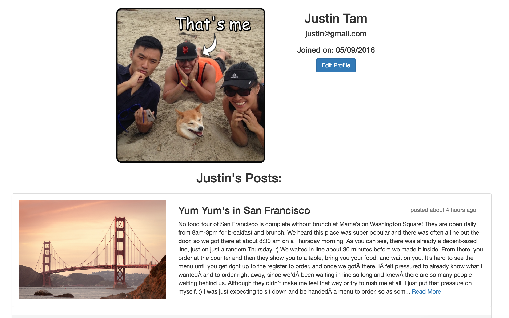

# Project-Vagabond

##### Share your travel experiences in different cities around the world

[Find it on Heroku](https://vagabond-team4.herokuapp.com/)

### Technologies Used
* Ruby on Rails
* Postgres
* Active Record
* html/scss

---

### Existing Features
* Pagination
* Truncating posts
* A User can:
  * sign up for an account.
  * log into their account if they have one.
  * logout if they are logged in
  * update their profile
  * add a profile picture
  * view an index of cities
  * create a post in a city
  * view posts from all users in each particular city
  * view an individual post
  * comment on an individual post
  * see all their posts in their public profile
  * see other users' public profile
  * edit/delete their own posts

---

### Planned Features
* A user is able to edit/delete their own comments
* User password reset
* Upvote/Downvote posts

---

### Contributors
[Justin Tam](https://github.com/jtam11)

[Anna Schwab](https://github.com/cloverharvest)

[Matt Vilhauer](https://github.com/matthewvilhauer)

[Scott Madrid](https://github.com/samadrid92)

### Screenshots

